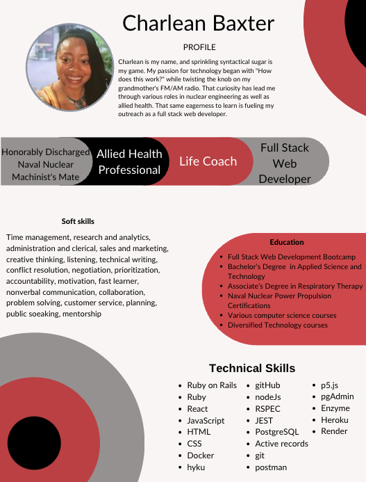

### Aloha world 🌺 👋 

👩‍💻 I'm currently working on my github repos. My excitement exposed me to several frameworks, so I planning to get some MVP closure on those projects. First will be my p5.js tutorial.

🧠 I'm currently learning how to responsibly use ChatGPT and other AI products. This tool is very beneficial to researching newer concepts. 

👯‍♀️ I'm looking to collaborate on events that support the advancement of novice and junior developers. Web development is a wonderful, innovative toolset. Gatekeeping this space will stifle progress. Tech can only advance by sharing the platform with future developers. Plus, mentorship is just as beneficial to the growth of seasoned developers as it is to the less experienced.

🤔 I'm looking for help with expanding my knowledge. Should I dig deeper in one programming language? Should I sample several?

💬 Ask me about anything. If I don't know, then WOO-HOO we get to research together.

⚡️ Fun fact: I get to inspire, mentor, and support aspiring and seasoned web developers daily as an instructor at LEARN Academy. 

