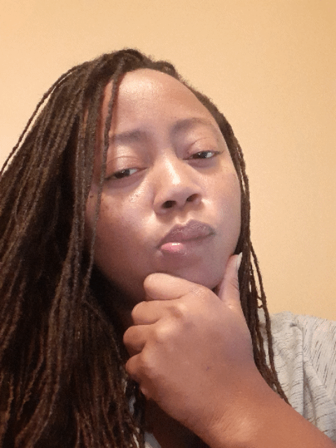

### Hello world 👋 

- 🔭 I’m currently working on a capstone project with Team Code Crak.
- 🌱 I’m currently learning how to become a syntactical magician as influenced by Learn Academy.
- 👯 I’m looking to collaborate on many future projects with various web developers in my current cohort.
- 🤔 I’m looking for help with learning the key concepts with various programming languages.
- 💬 Ask me about my current journey in web development, lessons learned as a web development student, any future goals
- 📫 How to reach me: baxtercm@outlook.com
- ⚡ Fun fact: Creativity, teaching, learning and implementing that knowledge are the fuels to my passionate approach to life.

